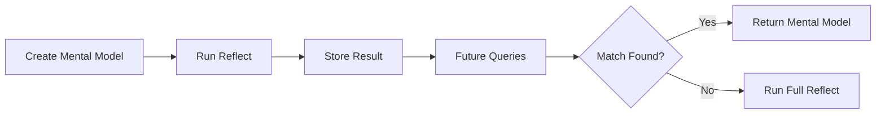

# Mental Models

User-curated summaries that provide high-quality, pre-computed answers for common queries.

{/* Import raw source files */}

## What Are Mental Models?

Mental models are **saved reflect responses** that you curate for your memory bank. When you create a mental model, Hindsight runs a reflect operation with your source query and stores the result. During future reflect calls, these pre-computed summaries are checked first — providing faster, more consistent answers.



### Why Use Mental Models?

| Benefit | Description |
|---------|-------------|
| **Consistency** | Same answer every time for common questions |
| **Speed** | Pre-computed responses are returned instantly |
| **Quality** | Manually curated summaries you've reviewed |
| **Control** | Define exactly how key topics should be answered |

### Hierarchical Retrieval

During reflect, the agent checks sources in priority order:

1. **Mental Models** — User-curated summaries (highest priority)
2. **Observations** — Consolidated knowledge
3. **Raw Facts** — Ground truth memories

Mental models are checked first because they represent your explicitly curated knowledge.

---

## Create a Mental Model

Creating a mental model runs a reflect operation in the background and saves the result:

### Python

```python
# Create a mental model (runs reflect in background)
result = client.create_mental_model(
    bank_id=BANK_ID,
    name="Team Communication Preferences",
    source_query="How does the team prefer to communicate?",
    tags=["team", "communication"]
)

# Returns an operation_id - check operations endpoint for completion
print(f"Operation ID: {result.operation_id}")
```

### CLI

```bash
# Create a mental model (async operation)
curl -X POST "http://localhost:8888/v1/default/banks/my-bank/mental-models" \
  -H "Content-Type: application/json" \
  -d '{
    "name": "Team Communication Preferences",
    "source_query": "How does the team prefer to communicate?",
    "tags": ["team"]
  }'

# Response: {"operation_id": "op-123"}
# Use the operations endpoint to check completion
```

### Parameters

| Parameter | Type | Required | Description |
|-----------|------|----------|-------------|
| `name` | string | Yes | Human-readable name for the mental model |
| `source_query` | string | Yes | The query to run to generate content |
| `tags` | list | No | Tags for filtering during retrieval |
| `max_tokens` | int | No | Maximum tokens for the mental model content |
| `trigger` | object | No | Trigger settings (see [Automatic Refresh](#automatic-refresh)) |

---

## Automatic Refresh

Mental models can be configured to **automatically refresh** when observations are updated. This keeps them in sync with the latest knowledge without manual intervention.

### Trigger Settings

| Setting | Type | Default | Description |
|---------|------|---------|-------------|
| `refresh_after_consolidation` | bool | false | Automatically refresh after observations consolidation |

When `refresh_after_consolidation` is enabled, the mental model will be re-generated every time the bank's observations are consolidated — ensuring it always reflects the latest synthesized knowledge.

### Python

```python
# Create a mental model with automatic refresh enabled
result = client.create_mental_model(
    bank_id=BANK_ID,
    name="Project Status",
    source_query="What is the current project status?",
    trigger={"refresh_after_consolidation": True}
)

# This mental model will automatically refresh when observations are updated
print(f"Operation ID: {result.operation_id}")
```

### CLI

```bash
# Create a mental model with automatic refresh enabled
curl -X POST "http://localhost:8888/v1/default/banks/my-bank/mental-models" \
  -H "Content-Type: application/json" \
  -d '{
    "name": "Project Status",
    "source_query": "What is the current project status?",
    "trigger": {"refresh_after_consolidation": true}
  }'
```

### When to Use Automatic Refresh

| Use Case | Automatic Refresh | Why |
|----------|-------------------|-----|
| **Real-time dashboards** | ✅ Enabled | Status should always be current |
| **Policy summaries** | ❌ Disabled | Policies change infrequently, manual refresh preferred |
| **User preferences** | ✅ Enabled | Preferences evolve with new interactions |
| **FAQ answers** | ❌ Disabled | Answers are curated, should be reviewed before updating |

:::tip
Enable automatic refresh for mental models that need to stay current. Disable it for curated content where you want to review changes before they go live.
---

## List Mental Models

### Python

```python
# List all mental models in a bank
mental_models = client.list_mental_models(bank_id=BANK_ID)

for mental_model in mental_models.items:
    print(f"- {mental_model.name}: {mental_model.source_query}")
```

### CLI

```bash
curl "http://localhost:8888/v1/default/banks/my-bank/mental-models"
```

---

## Get a Mental Model

### Python

```python
# Section 'get-mental-model' not found in api/mental-models.py
```

### CLI

```bash
curl "http://localhost:8888/v1/default/banks/my-bank/mental-models/{mental_model_id}"
```

### Response Fields

| Field | Type | Description |
|-------|------|-------------|
| `id` | string | Unique mental model ID |
| `bank_id` | string | Memory bank ID |
| `name` | string | Human-readable name |
| `source_query` | string | The query used to generate content |
| `content` | string | The generated mental model text |
| `tags` | list | Tags for filtering |
| `last_refreshed_at` | string | When the mental model was last updated |
| `created_at` | string | When the mental model was created |
| `reflect_response` | object | Full reflect response including `based_on` facts |

---

## Refresh a Mental Model

Re-run the source query to update the mental model with current knowledge:

### Python

```python
# Section 'refresh-mental-model' not found in api/mental-models.py
```

### CLI

```bash
curl -X POST "http://localhost:8888/v1/default/banks/my-bank/mental-models/{mental_model_id}/refresh"
```

Refreshing is useful when:
- New memories have been retained that affect the topic
- Observations have been updated
- You want to ensure the mental model reflects current knowledge

---

## Update a Mental Model

Update the mental model's name:

### Python

```python
# Section 'update-mental-model' not found in api/mental-models.py
```

### CLI

```bash
curl -X PATCH "http://localhost:8888/v1/default/banks/my-bank/mental-models/{mental_model_id}" \
  -H "Content-Type: application/json" \
  -d '{"name": "Updated Team Communication Preferences"}'
```

---

## Delete a Mental Model

### Python

```python
# Section 'delete-mental-model' not found in api/mental-models.py
```

### CLI

```bash
curl -X DELETE "http://localhost:8888/v1/default/banks/my-bank/mental-models/{mental_model_id}"
```

---

## Use Cases

| Use Case | Example |
|----------|---------|
| **FAQ Answers** | Pre-compute answers to common customer questions |
| **Onboarding Summaries** | "What should new team members know?" |
| **Status Reports** | "What's the current project status?" refreshed weekly |
| **Policy Summaries** | "What are our security policies?" |

---

## Next Steps

- [**Reflect**](./reflect) — How the agentic loop uses mental models
- [**Observations**](/developer/observations) — How knowledge is consolidated
- [**Operations**](./operations) — Track async mental model creation
