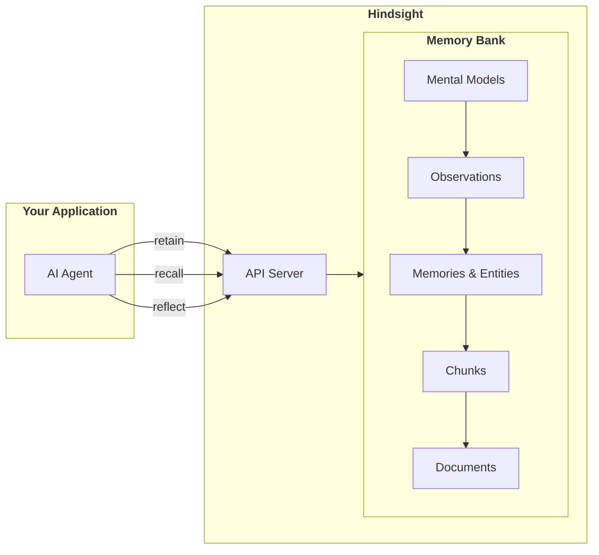
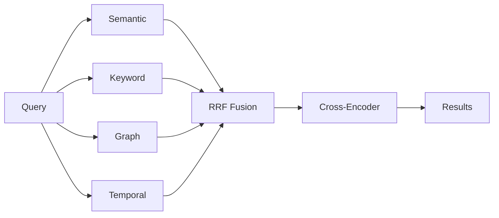

# Overview

## Why Hindsight?

AI agents forget everything between sessions. Every conversation starts from zero—no context about who you are, what you've discussed, or what the assistant has learned. This isn't just an implementation detail; it fundamentally limits what AI Agents can do.

**The problem is harder than it looks:**

- **Simple vector search isn't enough** — "What did Alice do last spring?" requires temporal reasoning, not just semantic similarity
- **Facts get disconnected** — Knowing "Alice works at Google" and "Google is in Mountain View" should let you answer "Where does Alice work?" even if you never stored that directly
- **AI Agents need to consolidate knowledge** — A coding assistant that remembers "the user prefers functional programming" should consolidate this into an observation and weigh it when making recommendations
- **Context matters** — The same information means different things to different memory banks with different personalities

Hindsight solves these problems with a memory system designed specifically for AI agents.

## What Hindsight Does

**Your AI agent** stores information via `retain()`, searches with `recall()`, and reasons with `reflect()` — all interactions with its dedicated **memory bank**

## Key Components

### Memory Types

Hindsight organizes knowledge into a hierarchy of facts and consolidated knowledge:

| Type | What it stores | Example |
|------|----------------|---------|
| **Mental Model** | User-curated summaries for common queries | "Team communication best practices" |
| **Observation** | Automatically consolidated knowledge from facts | "User was a React enthusiast but has now switched to Vue" (captures history) |
| **World Fact** | Objective facts received | "Alice works at Google" |
| **Experience Fact** | Bank's own actions and interactions | "I recommended Python to Bob" |

During reflect, the agent checks sources in priority order: **Mental Models → Observations → Raw Facts**.

### Multi-Strategy Retrieval (TEMPR)

Four search strategies run in parallel:

| Strategy | Best for |
|----------|----------|
| **Semantic** | Conceptual similarity, paraphrasing |
| **Keyword (BM25)** | Names, technical terms, exact matches |
| **Graph** | Related entities, indirect connections |
| **Temporal** | "last spring", "in June", time ranges |

### Observation Consolidation

After memories are retained, Hindsight automatically consolidates related facts into **observations** — synthesized knowledge representations that capture patterns and learnings:

- **Automatic synthesis**: New facts are analyzed and consolidated into existing or new observations
- **Evidence tracking**: Each observation tracks which facts support it
- **Continuous refinement**: Observations evolve as new evidence arrives

### Mission, Directives & Disposition

Memory banks can be configured to shape how the agent reasons during `reflect`:

| Configuration | Purpose | Example |
|---------------|---------|---------|
| **Mission** | Natural language identity for the bank | "I am a research assistant specializing in ML. I prefer simplicity over cutting-edge." |
| **Directives** | Hard rules the agent must follow | "Never recommend specific stocks", "Always cite sources" |
| **Disposition** | Soft traits that influence reasoning style | Skepticism, literalism, empathy (1-5 scale) |

The **mission** tells Hindsight what knowledge to prioritize and provides context for reasoning. **Directives** are guardrails and compliance rules that must never be violated. **Disposition traits** subtly influence interpretation style.

These settings only affect the `reflect` operation, not `recall`.

## Next Steps

### Getting Started
- [**Quick Start**](/developer/api/quickstart) — Install and get up and running in 60 seconds
- [**RAG vs Hindsight**](/developer/rag-vs-hindsight) — See how Hindsight differs from traditional RAG with real examples

### Core Concepts
- [**Retain**](/developer/retain) — How memories are stored with multi-dimensional facts
- [**Recall**](/developer/retrieval) — How TEMPR's 4-way search retrieves memories
- [**Reflect**](/developer/reflect) — How mission, directives, and disposition shape reasoning

### API Methods
- [**Retain**](/developer/api/retain) — Store information in memory banks
- [**Recall**](/developer/api/recall) — Search and retrieve memories
- [**Reflect**](/developer/api/reflect) — Agentic reasoning with memory
- [**Mental Models**](/developer/api/mental-models) — User-curated summaries for common queries
- [**Memory Banks**](/developer/api/memory-banks) — Configure mission, directives, and disposition
- [**Documents**](/developer/api/documents) — Manage document sources
- [**Operations**](/developer/api/operations) — Monitor async tasks

### Deployment
- [**Server Setup**](/developer/installation) — Deploy with Docker Compose, Helm, or pip
