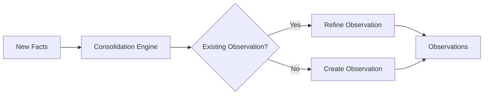

# Observations: Knowledge Consolidation

After memories are retained, Hindsight automatically consolidates related facts into **observations** — synthesized knowledge representations that capture patterns and learnings.



---

## What Are Observations?

Observations are **consolidated knowledge** synthesized from multiple facts. Unlike raw facts which are individual pieces of information, observations represent patterns, preferences, and learnings that emerge from accumulated evidence.

| Raw Facts | Observation |
|-----------|--------------|
| "Alice prefers Python" | "Alice is a Python-focused developer who values readability and simplicity" |
| "Alice dislikes verbose code" | |
| "Alice recommends type hints" | |

Observations provide:
- **Synthesis**: Patterns that emerge from multiple facts
- **Context**: Richer understanding than individual facts
- **Efficiency**: Condensed knowledge for faster retrieval

---

## How Consolidation Works

### Automatic Background Processing

After `retain()` completes, the consolidation engine runs automatically:

1. **New facts analyzed** — Each new fact is compared against existing observations
2. **Pattern detection** — Related facts are grouped and synthesized
3. **Observation creation/update** — New observations are created or existing ones refined
4. **Evidence tracking** — Each observation maintains references to supporting facts

### Evidence-Based Evolution

Observations evolve as new evidence arrives:

| Event | What the bank learns | Observation state |
|-------|---------------------|----------------|
| **Day 1** | "Redis is open source under BSD license" | "Redis is excellent for caching — fast, reliable, and OSS-friendly" (2 supporting facts) |
| **Day 2** | "Redis has great community support" | Observation reinforced (3 supporting facts) |
| **Day 30** | "Redis changed license to SSPL" | Observation refined: "Redis is technically strong, but has license concerns for cloud" |
| **Day 45** | "Valkey forked Redis under BSD" | New observation: "Consider Valkey for new projects requiring true OSS" |

### Handling Contradictory Evidence

What happens when a new fact contradicts an existing observation?

The consolidation engine doesn't blindly overwrite — it **reconciles** the contradiction by capturing the evolution:

**Example: User preference changes**

| Time | Fact | Observation |
|------|------|--------------|
| Week 1 | "User says they love React" | "User prefers React for frontend development" |
| Week 2 | "User praises React's component model" | "User is enthusiastic about React, particularly its component model" |
| Week 3 | "User says they've switched to Vue and won't use React anymore" | "User was previously a React enthusiast who appreciated its component model, but has now switched to Vue and no longer uses React" |

Notice how the final observation captures the **full journey** — not just "User prefers Vue" but the complete evolution of their preference. This nuanced understanding means:

- Your agent won't recommend React tutorials to someone who explicitly moved away from it
- Your agent understands *why* this matters (they were enthusiastic before, so this is a deliberate choice)
- Your agent can reference this history when relevant ("I know you used to work with React...")

The system:
1. **Detects the conflict** — New fact contradicts existing observation
2. **Preserves history** — Incorporates the previous understanding into the new observation
3. **Creates nuanced observation** — Synthesizes a richer understanding that captures the change
4. **Updates freshness** — Marks the observation as recently updated

**Example: Correcting misinformation**

| Time | Fact | Observation |
|------|------|--------------|
| Day 1 | "Alice works at Google" | "Alice is a Google employee" |
| Day 10 | "Alice actually works at Meta, not Google" | "Alice works at Meta (previously thought to work at Google)" |

When a fact explicitly corrects previous information, the observation is updated to reflect the correction while noting the previous understanding. The raw facts are always preserved, so you can trace back to see what was originally stated and when it was corrected.

---

## Observations in Retrieval

Observations are automatically included in both `recall()` and `reflect()` operations:

### In Recall

Observations are returned alongside raw facts, filtered by the `types` parameter:

```python
# Include observations in recall
results = client.recall(
    bank_id="my-bank",
    query="What programming languages does Alice prefer?",
    types=["world", "experience", "observation"]
)

# Observations only
observations = client.recall(
    bank_id="my-bank",
    query="What patterns have I learned?",
    types=["observation"]
)
```

### In Reflect

The reflect agent uses **hierarchical retrieval**:

1. **[Mental Models](/developer/api/mental-models)** — User-curated summaries (highest priority)
2. **Observations** — Consolidated knowledge with freshness awareness
3. **Raw Facts** — Ground truth for verification

The agent automatically queries observations and uses them to inform its reasoning.

---

## Freshness Awareness

Observations track when they were last updated. During reflect, the agent considers freshness:

- **Fresh observations**: Used directly for reasoning
- **Stale observations**: Agent verifies against current facts before relying on them

This ensures responses stay accurate even as the underlying data changes.

---

## Mission-Oriented Consolidation

The bank's **mission** directly influences what knowledge gets consolidated into observations. When you set a mission on your memory bank, the consolidation engine focuses on extracting knowledge that serves that mission.

**Example:**

```python
client.create_bank(
    bank_id="support-agent",
    mission="You're a customer support agent - keep track of "
            "customer preferences, past issues, and communication styles."
)
```

With this mission, the consolidation engine will:
- **Prioritize** customer preferences, issue patterns, and communication styles
- **Skip** ephemeral details that don't serve support goals
- **Synthesize** observations focused on helping customers

Without a mission, the engine performs general-purpose consolidation. With a mission, it becomes focused and efficient — extracting only knowledge that matters for your use case.

| Mission | Observations Focus |
|---------|-------------------|
| *Customer support agent* | Customer preferences, issue patterns, resolution history |
| *Code review assistant* | Coding patterns, team conventions, common mistakes |
| *Research assistant* | Topic expertise, source reliability, methodology preferences |

---

## Configuration

Observation consolidation runs automatically. You can monitor consolidation via the [Operations API](./api/operations).

---

## Next Steps

- [**Retain**](./retain) — How facts are stored and trigger consolidation
- [**Recall**](./retrieval) — How observations are retrieved
- [**Reflect**](./reflect) — How the agentic loop uses observations
- [**Mental Models**](./api/mental-models) — User-curated summaries for common queries
