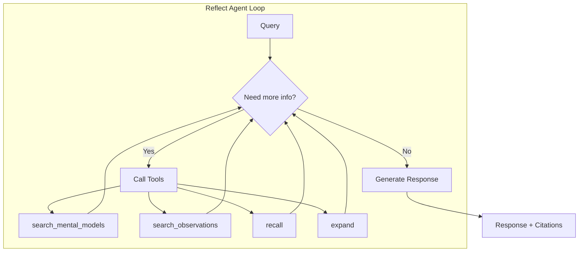

# Reflect: Agentic Reasoning with Disposition

When you call `reflect()`, Hindsight runs an **agentic loop** that autonomously gathers evidence and reasons through the lens of the bank's disposition to generate contextual responses.



---

## How It Works

Unlike simple retrieval, reflect is an **agentic system** that:

1. **Autonomously gathers evidence** — The agent decides what information it needs and calls appropriate tools
2. **Uses hierarchical retrieval** — Checks mental models first, then observations, then raw facts
3. **Applies disposition** — Shapes reasoning based on the bank's personality traits
4. **Enforces directives** — Hard rules that must be followed in all responses
5. **Cites sources** — Returns which memories and observations were used

### The Agentic Loop

The reflect agent runs in a loop with access to these tools:

| Tool | Purpose | Priority |
|------|---------|----------|
| `search_mental_models` | User-curated summaries | Highest (check first) |
| `search_observations` | Consolidated knowledge | High |
| `recall` | Raw facts (ground truth) | Fallback |
| `expand` | Get more context for a memory | As needed |
| `done` | Complete with final answer | When ready |

The agent:
- **Must gather evidence** before answering (guardrail prevents empty responses)
- **Runs up to 10 iterations** to find relevant information
- **Validates citations** — only IDs that were actually retrieved can be cited

### Hierarchical Retrieval Strategy

The agent uses a smart retrieval hierarchy:

1. **[Mental Models](/developer/api/mental-models)** — User-curated summaries you've pre-computed for common queries
2. **[Observations](/developer/observations)** — Consolidated knowledge with freshness awareness
3. **Raw Facts** — Ground truth for verification when observations are stale

**Mental models** are saved reflect responses that you create for frequently asked questions. They're checked first because they represent explicitly curated knowledge. See the [Mental Models API](/developer/api/mental-models) for how to create and manage them.

If an observation is marked as **stale**, the agent automatically verifies it against current facts.

---

## Why Reflect?

Most AI systems can retrieve facts, but they can't **reason** about them in a consistent way.

### The Problem

Without reflect:
- **No consistent character**: Same question gets different answers each time
- **No knowledge synthesis**: System never connects related facts
- **No reasoning context**: Responses don't reflect accumulated knowledge
- **Generic responses**: Every AI sounds the same

### The Value

With reflect:
- **Consistent character**: A "detail-oriented, cautious" bank emphasizes risks and thorough planning
- **Evolving knowledge**: Observations strengthen and adapt as evidence accumulates
- **Contextual reasoning**: "Based on what I know about your team's remote work success..."
- **Differentiated behavior**: Support bots sound diplomatic, code reviewers sound direct

### When to Use Reflect

| Use `recall()` when... | Use `reflect()` when... |
|------------------------|-------------------------|
| You need raw facts | You need reasoned interpretation |
| You're building your own reasoning | You want disposition-consistent responses |
| You need maximum control | You want the bank to "think" for itself |
| Simple fact lookup | Forming recommendations |

**Example:**
- `recall("Alice")` → Returns all Alice facts and relevant mental models
- `reflect("Should we hire Alice?")` → Agent gathers evidence about Alice, reasons about fit, returns answer with citations

---

## Disposition Traits

When you create a memory bank, you can configure its disposition using three traits. These traits influence how the bank interprets information and reasons during `reflect()`:

| Trait | Scale | Low (1) | High (5) |
|-------|-------|---------|----------|
| **Skepticism** | 1-5 | Trusting, accepts information at face value | Skeptical, questions and doubts claims |
| **Literalism** | 1-5 | Flexible interpretation, reads between the lines | Literal interpretation, takes things at face value |
| **Empathy** | 1-5 | Detached, focuses on facts | Empathetic, considers emotional context |

### Mission: Natural Language Identity

Beyond numeric traits, you can provide a natural language **mission** that describes the bank's identity:

```python
client.create_bank(
    bank_id="architect-bank",
    mission="You're a senior software architect - keep track of system designs, "
            "technology decisions, and architectural patterns. Prefer simplicity over cutting-edge.",
    disposition={
        "skepticism": 4,   # Questions new technologies
        "literalism": 4,   # Focuses on concrete specs
        "empathy": 2       # Prioritizes technical facts
    }
)
```

The mission tells Hindsight what knowledge to prioritize and shapes how disposition traits are applied:
- "keep track of system designs" → focuses consolidation on architectural decisions
- "prefer simplicity over cutting-edge" + high skepticism → questions complex solutions
- Explicit guidance → consistent memory focus across conversations

---

## Disposition Shapes Reasoning

Two banks with different dispositions, given identical facts about remote work:

**Bank A** (low skepticism, high empathy):
> "Remote work enables flexibility and work-life balance. The team seems happier and more productive when they can choose their environment."

**Bank B** (high skepticism, low empathy):
> "Remote work claims need verification. What are the actual productivity metrics? The anecdotal benefits may not translate to measurable outcomes."

**Same facts → Different conclusions** because disposition shapes interpretation.

---

## Disposition Presets by Use Case

Different use cases benefit from different disposition configurations:

| Use Case | Recommended Traits | Why |
|----------|-------------------|-----|
| **Customer Support** | skepticism: 2, literalism: 2, empathy: 5 | Trusting, flexible, understanding |
| **Code Review** | skepticism: 4, literalism: 5, empathy: 2 | Questions assumptions, precise, direct |
| **Legal Analysis** | skepticism: 5, literalism: 5, empathy: 2 | Highly skeptical, exact interpretation |
| **Therapist/Coach** | skepticism: 2, literalism: 2, empathy: 5 | Supportive, reads between lines |
| **Research Assistant** | skepticism: 4, literalism: 3, empathy: 3 | Questions claims, balanced interpretation |

---

## Directives: Hard Rules

While disposition traits *influence* reasoning style, **directives** are hard rules that the agent *must* follow. Directives are injected into the prompt and enforced in every response.

### When to Use Directives

Use directives for constraints that must never be violated:

- **Compliance rules**: "Never recommend specific stocks or financial products"
- **Privacy constraints**: "Never share personal data with third parties"
- **Style requirements**: "Always respond in formal English"
- **Domain guardrails**: "Always cite sources when making factual claims"

### Directives vs Disposition

| Aspect | Disposition | Directives |
|--------|-------------|------------|
| **Nature** | Soft influence | Hard rules |
| **Effect** | Shapes interpretation and tone | Must be followed exactly |
| **Violation** | Acceptable (it's a tendency) | Not acceptable |
| **Example** | High skepticism → questions claims | "Never make medical diagnoses" |

:::tip
Use disposition for personality and character. Use directives for compliance and guardrails.
See [Memory Banks: Directives](/developer/api/memory-banks#directives) for how to create and manage directives.

---

## What You Get from Reflect

When you call `reflect()`:

**Returns:**
- **Response text** — Disposition-influenced answer from the agent
- **based_on** — Evidence used: memories, mental models, and directives that grounded the response
- **trace** — Tool calls, LLM calls, and observations accessed (when `include.tool_calls=True`)
- **structured_output** — Parsed response if `response_schema` was provided
- **usage** — Token usage metrics

**Example:**
```json
{
  "text": "Based on Alice's ML expertise and her work at Google, she'd be an excellent fit for the research team lead position...",
  "based_on": {
    "memories": [
      {"id": "mem-123", "text": "Alice has 5 years of ML experience", "type": "world"},
      {"id": "mem-456", "text": "Alice worked at Google on search ranking", "type": "experience"}
    ],
    "mental_models": [],
    "directives": [
      {"id": "dir-001", "name": "Formal Language", "rules": ["Always respond in formal English"]}
    ]
  },
  "usage": {"input_tokens": 1500, "output_tokens": 500, "total_tokens": 2000}
}
```

The agent automatically gathers evidence, validates citations, and generates a grounded response.

---

## Why Disposition Matters

Without disposition, all AI assistants sound the same. With disposition:

- **Customer support bots** can be diplomatic and empathetic
- **Code review assistants** can be direct and thorough
- **Creative assistants** can be open to unconventional ideas
- **Risk analysts** can be appropriately cautious

Disposition creates **consistent character** across conversations while observations **evolve with evidence**.

---

## Next Steps

- [**Observations**](./observations) — How knowledge is consolidated
- [**Retain**](./retain) — How rich facts are stored
- [**Recall**](./retrieval) — How multi-strategy search works
- [**Reflect API**](./api/reflect) — Code examples and parameters
