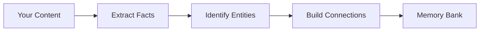

# Retain: How Hindsight Stores Memories

When you call `retain()`, Hindsight transforms conversations and documents into structured, searchable memories that preserve meaning and context.

## What Retain Does

---

## Rich Fact Extraction

Hindsight doesn't just store what was said — it captures **why**, **how**, and **what it means**.

### What Gets Captured

When you retain "Alice joined Google last spring and was thrilled about the research opportunities", Hindsight extracts:

**The core facts:**
- Alice joined Google
- This happened last spring

**The emotions and meaning:**
- She was thrilled
- It represented an important opportunity

**The reasoning:**
- She chose it for the research opportunities

This rich extraction means you can later ask "Why did Alice join Google?" and get a meaningful answer, not just "she joined Google."

### Preserving Context

Traditional systems fragment information:
- "Bob suggested Summer Vibes"
- "Alice wanted something unique"
- "They chose Beach Beats"

Hindsight preserves the full narrative:
- "Alice and Bob discussed naming their summer party playlist. Bob suggested 'Summer Vibes' because it's catchy, but Alice wanted something unique. They ultimately decided on 'Beach Beats' for its playful tone."

This means search results include the full context, not disconnected fragments.

---

## Two Types of Facts

Hindsight distinguishes between **world** facts (about others) and **experience** (conversations and events):

| Type            | Description                       | Example |
|-----------------|-----------------------------------|---------|
| **world**       | Facts about people, places, things | "Alice works at Google" |
| **experience** | Conversations and events         | "I recommended Python to Alice" |

**Note:** Observations are consolidated automatically in the background after `retain()` operations complete. This consolidation process synthesizes patterns from new facts into the bank's knowledge base.

---

## Entity Recognition

Hindsight automatically identifies and tracks **entities** — the people, organizations, and concepts that matter.

### What Gets Recognized

- **People:** "Alice", "Dr. Smith", "Bob Chen"
- **Organizations:** "Google", "MIT", "OpenAI"
- **Places:** "Paris", "Central Park", "California"
- **Products & Concepts:** "Python", "TensorFlow", "machine learning"

### Entity Resolution

The same entity mentioned different ways gets unified:
- "Alice" + "Alice Chen" + "Alice C." → one person
- "Bob" + "Robert Chen" → one person (nickname resolution)

**Why it matters:** You can ask "What do I know about Alice?" and get everything, even if she was mentioned as "Alice Chen" in some conversations.

### Context-Aware Disambiguation

If "Alice" appears with "Google" and "Stanford" multiple times, a new "Alice" mentioning those is likely the same person. Hindsight uses co-occurrence patterns to disambiguate common names.

---

## Building Connections

Memories aren't isolated — Hindsight creates a **knowledge graph** with four types of connections:

### Entity Connections

All facts mentioning the same entity are linked together.

**Enables:** "Tell me everything about Alice" → retrieves all Alice-related facts

### Time-Based Connections

Facts close in time are connected, with stronger links for closer dates.

**Enables:** "What else happened around then?" → finds contextually related events

### Meaning-Based Connections

Semantically similar facts are linked, even if they use different words.

**Enables:** "Tell me about similar topics" → finds thematically related information

### Causal Connections

Cause-effect relationships are explicitly tracked.

**Enables:** "Why did this happen?" → trace reasoning chains
**Example:** "Alice felt burned out" ← caused by ← "She worked 80-hour weeks"

---

## Understanding Time

Hindsight tracks **two temporal dimensions**:

### When It Happened

For events (meetings, trips, milestones), Hindsight records when they occurred.
- "Alice got married in June 2024" → occurred in June 2024

For general facts (preferences, characteristics), there's no specific occurrence time.
- "Alice prefers Python" → ongoing preference

### When You Learned It

Hindsight also tracks when you told it each fact.

**Why both?**

Imagine in January 2025, someone tells you "Alice got married in June 2024":
- **Historical queries** work: "What did Alice do in 2024?" → finds the marriage
- **Recency ranking** works: Recent mentions get priority in search
- **Temporal reasoning** works: "What happened before her marriage?" → finds earlier events

Without this distinction, old information would either be unsearchable by date or treated as irrelevant.

---

## Tagging Memories

Tags enable visibility scoping—useful when one memory bank serves multiple users but each should only see relevant memories.

- **Item tags**: Tag individual memories with specific scopes
- **Document tags**: Apply tags to all items in a batch
- **Tag filtering**: Filter during recall/reflect by tags

See [Retain API](./api/retain) for code examples and [Recall API](./api/recall) for filtering options.

---

## What You Get

After `retain()` completes:

- **Structured facts** that preserve meaning, emotions, and reasoning
- **Unified entities** that resolve different name variations
- **Knowledge graph** with entity, temporal, semantic, and causal links
- **Temporal grounding** for both historical and recency-based queries
- **Optional tags** for filtering during recall

All stored in your isolated **memory bank**, ready for `recall()` and `reflect()`.

---

## Observation Consolidation

After `retain()` completes, Hindsight automatically triggers **observation consolidation** in the background. This process:

1. Analyzes new facts against existing observations
2. Creates new observations when patterns emerge
3. Refines existing observations with new evidence
4. Tracks which facts support each observation

This happens asynchronously — your `retain()` call returns immediately while consolidation runs in the background.

See [Observations](./observations) for details on how consolidation works.

---

## Next Steps

- [**Observations**](./observations) — How knowledge is consolidated after retain
- [**Recall**](./retrieval) — How multi-strategy search retrieves relevant memories
- [**Reflect**](./reflect) — How the agentic loop uses observations
- [**Retain API**](./api/retain) — Code examples and parameters
