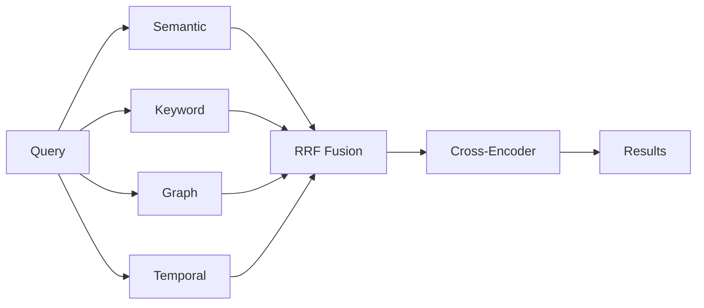

# Recall: How Hindsight Retrieves Memories

When you call `recall()`, Hindsight uses multiple search strategies in parallel to find the most relevant memories, regardless of how you phrase your query.



---

## The Challenge of Memory Recall

Different queries need different search approaches:

- **"Alice works at Google"** → needs exact name matching
- **"Where does Alice work?"** → needs semantic understanding
- **"What did Alice do last spring?"** → needs temporal reasoning
- **"Why did Alice leave?"** → needs causal relationship tracing

No single search method handles all these well. Hindsight solves this with **TEMPR** — four complementary strategies that run in parallel.

---

## Four Search Strategies

### Semantic Search

**What it does:** Understands the *meaning* behind words, not just the words themselves.

**Best for:**
- Conceptual matches: "Alice's job" → "Alice works as a software engineer"
- Paraphrasing: "Bob's expertise" → "Bob specializes in machine learning"
- Synonyms: "meeting" matches "conference", "discussion", "gathering"

**Why it matters:** You can ask questions naturally without matching exact keywords.

---

### Keyword Search

**What it does:** Finds exact terms and names, even when they're spelled uniquely.

**Best for:**
- Proper nouns: "Google", "Alice Chen", "MIT"
- Technical terms: "PostgreSQL", "HNSW", "TensorFlow"
- Unique identifiers: URLs, product names, specific phrases

**Why it matters:** Ensures you never miss results that mention specific names or terms, even if they're semantically distant from your query.

---

### Graph Traversal

**What it does:** Follows connections between entities to find indirectly related information.

**Best for:**
- Indirect relationships: "What does Alice do?" → Alice → Google → Google's products
- Entity exploration: "Bob's colleagues" → Bob → co-workers → shared projects
- Multi-hop reasoning: "Alice's team's achievements"

**Why it matters:** Retrieves facts that aren't semantically or lexically similar but are **structurally connected** through the knowledge graph.

**Example:** Even if Alice and her manager are never mentioned together, graph traversal can find the manager through shared projects or team relationships.

---

### Temporal Search

**What it does:** Understands time expressions and filters by when events occurred.

**Best for:**
- Historical queries: "What did Alice do in 2023?"
- Time ranges: "What happened last spring?"
- Relative time: "What did Bob work on last year?"
- Before/after: "What happened before Alice joined Google?"

**How it works:** Combines semantic understanding with time filtering to find events within specific periods.

**Why it matters:** Enables precise historical queries without losing old information.

---

## Result Fusion

After the four strategies run, results are **fused together**:

- Memories appearing in **multiple strategies** rank higher (consensus)
- **Rank matters more than score** (robust across different scoring systems)
- Final results are **re-ranked** using a neural model that considers query-memory interaction

**Why fusion matters:** A fact that's both semantically similar AND mentions the right entity will rank higher than one that's only semantically similar.

---

## Why Multiple Strategies?

Consider the query: **"What did Alice say about Python last spring?"**

- **Semantic** finds facts about Alice's views on programming
- **Keyword** ensures "Python" is actually mentioned
- **Graph** connects Alice → programming languages → related entities
- **Temporal** filters to "last spring" timeframe

The **fusion** of all four gives you exactly what you're looking for, even though no single strategy would suffice.

---

## Token Budget Management

Hindsight is built for AI agents, not humans. Traditional search systems return "top-k" results, but agents don't think in terms of result counts—they think in tokens. An agent's context window is measured in tokens, and that's exactly how Hindsight measures results.

**How it works:**
- Top-ranked memories selected first
- Stops when token budget is exhausted
- You specify context budget, Hindsight fills it with the most relevant memories

**Parameters you control:**
- `max_tokens`: How much memory content to return (default: 4096 tokens)
- `budget`: Search depth level (low, mid, high)
- `types`: Filter by world, experience, observation, or all
- `tags`: Filter memories by visibility tags
- `tags_match`: How to match tags (see [Recall API](./api/recall) for all options)

### Expanding Context: Chunks

Memories are distilled facts—concise but sometimes missing nuance. When your agent needs deeper context, you can optionally retrieve the source material:

**Chunks** return the raw text that generated each memory—useful when the distilled fact loses important nuance:

```
Memory: "Alice prefers Python over JavaScript"
Chunk:  "Alice mentioned she prefers Python over JavaScript, mainly because
         of its data science ecosystem, though she admits JS is better for
         frontend work and she's been learning TypeScript lately."
```

Use `include_chunks=True` with `max_chunk_tokens` to control the token budget for chunks. This is useful when generating responses that need verbatim quotes or when context matters (e.g., "What exactly did Alice say about the project?").

---

## Tuning Recall: Quality vs Latency

Different use cases require different trade-offs between **recall quality** and **response speed**. Two parameters control this:

### Budget: Search Depth

Controls how thoroughly Hindsight explores the memory bank—affecting graph traversal depth, candidate pool size, and cross-encoder re-ranking:

| Budget | Best For | Trade-off |
|--------|----------|-----------|
| **low** | Quick lookups, simple queries | Fast, may miss indirect connections |
| **mid** | Most queries, balanced | Good coverage, reasonable speed |
| **high** | Complex queries requiring deep exploration | Thorough, slower |

**Example:** "What did Alice's manager's team work on?" benefits from high budget to traverse multiple hops (Alice → manager → team → projects) and evaluate more candidates.

### Max Tokens: Context Window Size

Controls how much memory content to return:

| Max Tokens | ~Pages of Text | Best For | Trade-off |
|------------|----------------|----------|-----------|
| **2048** | ~2 pages | Focused answers, fast LLM | Fewer memories, faster |
| **4096** (default) | ~4 pages | Balanced context | Good coverage, standard |
| **8192** | ~8 pages | Comprehensive context | More memories, slower LLM |

**Example:** "Summarize everything about Alice" benefits from higher max_tokens to include more facts.

### Two Independent Dimensions

Budget and max_tokens control different aspects of recall:

| Parameter | What it controls | Latency impact | Example |
|-----------|------------------|----------------|---------|
| **Budget** | How thoroughly to explore memories | Search time | High budget finds Alice → manager → team → projects |
| **Max Tokens** | How much context to return | LLM processing time | High tokens returns more memories to the agent |

**They're independent.** Common combinations:

| Budget | Max Tokens | Use Case |
|--------|------------|----------|
| high | low | Deep search, return only the best results |
| low | high | Quick search, return everything found |
| high | high | Comprehensive research queries |
| low | low | Fast chatbot responses |

### Recommended Configurations

| Use Case | Budget | Max Tokens | Why |
|----------|--------|------------|-----|
| **Chatbot replies** | low | 2048 | Fast responses, focused context |
| **Document Q&A** | mid | 4096 | Balanced coverage and speed |
| **Research queries** | high | 8192 | Comprehensive, multi-hop reasoning |
| **Real-time search** | low | 2048 | Minimize latency |

---

## Graph Retrieval Algorithms

Hindsight supports multiple graph traversal algorithms. The default (`link_expansion`) is optimized for fast retrieval with target latency under 100ms.

See [Configuration → Retrieval](./configuration#retrieval) for available algorithms and how to configure them.

---

## Next Steps

- [**Retain**](./retain) — How memories are stored with rich context
- [**Reflect**](./reflect) — How disposition influences reasoning
- [**Recall API**](./api/recall) — Code examples, parameters, and tag filtering
